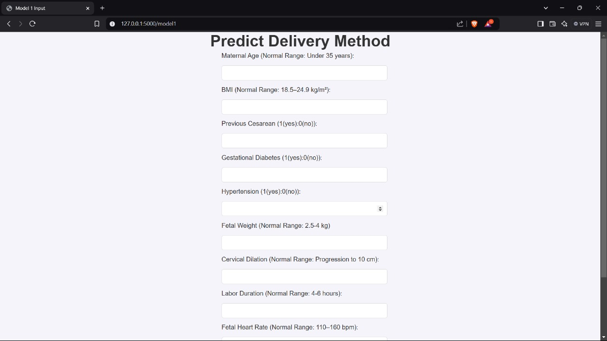
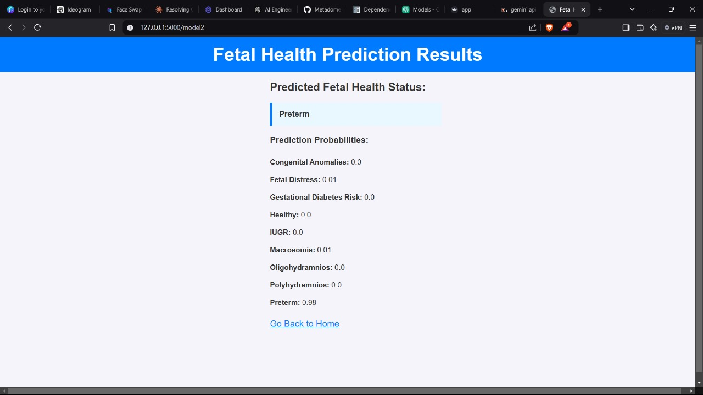
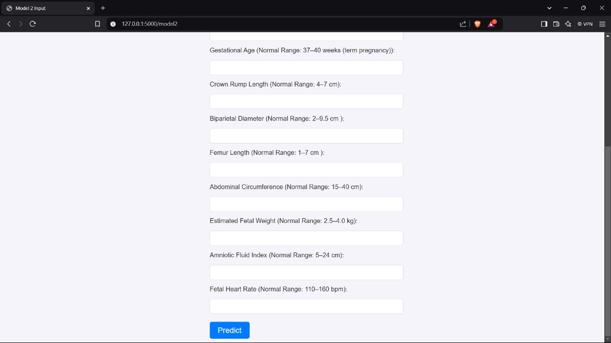
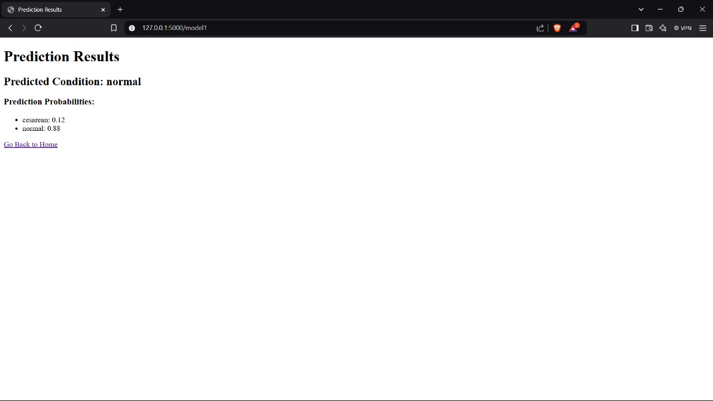
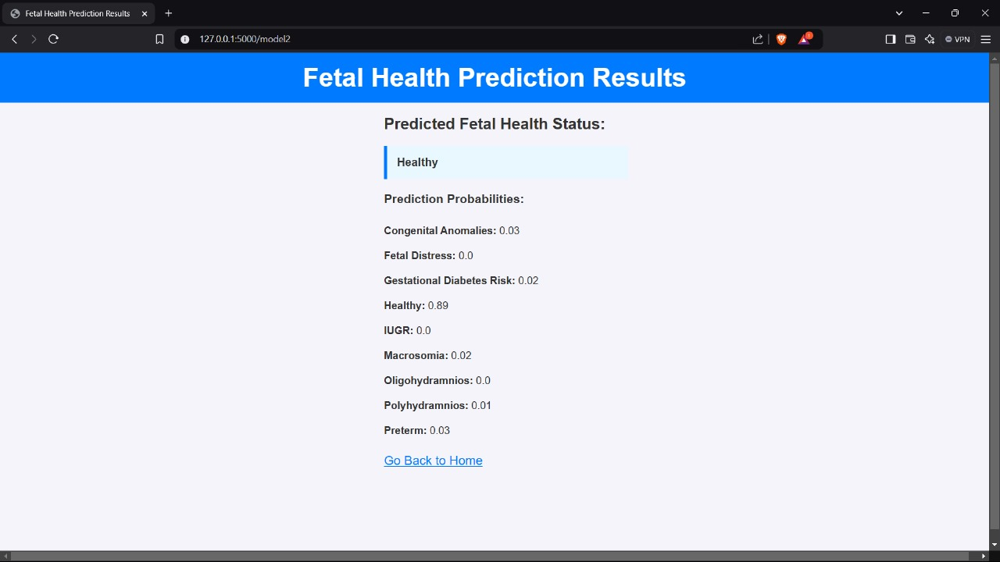
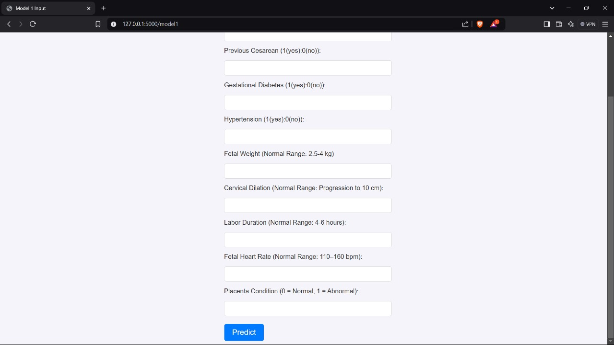

<div align="center">
  <h1>🧠 Fetal Health Prediction & Monitoring System</h1>
  <p>AI-powered health analytics tool for early identification and real-time monitoring of fetal conditions</p>
  
</div>

---

## 🩺 Overview

This project is a smart web application built to **predict fetal health** conditions and **monitor medical parameters** continuously. It leverages machine learning to assist medical professionals and caretakers in identifying risky fetal states—**Normal**, **Suspect**, or **Pathological**—and displays dynamic health dashboards for real-time observation.

---

## 🚀 Key Features

- 🔍 **ML-Based Health Prediction**  
  Predicts fetal condition using multiple medical inputs via a trained classification model.

- 📈 **Live Monitoring Dashboard**  
  Real-time (or simulated) visualization of fetal health metrics like heart rate, variability, and contraction.

- 🚨 **Risk Alerts**  
  Automated alerts for abnormal fetal heart rate or other thresholds.

- 💬 **Interactive Chatbot**  
  Optional SI Chatbot integration for user support and guidance.

---

## 🧪 Technical Stack

| Layer     | Technologies                      |
|-----------|-----------------------------------|
| Frontend  | HTML, CSS, Bootstrap, JavaScript |
| Backend   | Python (Flask)                   |
| ML Model  | Scikit-learn, Pandas, NumPy      |
| Charts    | Plotly / Chart.js / Matplotlib   |
| Hosting   | PythonAnywhere / Heroku          |

---

## 🧠 Machine Learning

- **Dataset**: UCI Fetal Health Classification
- **Models Tried**: Logistic Regression, Decision Tree, Random Forest
- **Final Accuracy**: ~91%
- **Key Features Used**:
  - Baseline FHR
  - Accelerations
  - Uterine contractions
  - Variability measures
  - Mean short-term variability

---

## 📸 Visual Insights

| 📷 Image | 💡 Description |
|---------|----------------|
|  | **Landowner & Tenant Roles** – Outlines property rights and land use roles. |
|  | **Tenancy Terms** – Includes rental conditions and consent requirements. |
|  | **Inheritance Process** – Specifies property succession and heir rights. |
|  | **Traditional Leadership Role** – Elders/clans influence land decisions. |
|  | **Boundary Disputes** – Mediated via community arbitration. |
|  | **Customary Tenure** – Communal ownership and farming rights. |
|  | **Land Registration Types** – Formal vs informal land systems. |
|  | **Land Reforms** – Legal titling and modernization efforts. |

> 📝 *These visual components were used to explore community-based health policies and their impact on maternal care and land-based health rights.*

---

## 🧰 How to Run Locally

```bash
git clone https://github.com/your-username/fetal-health-monitoring.git
cd fetal-health-monitoring
pip install -r requirements.txt
python app.py
